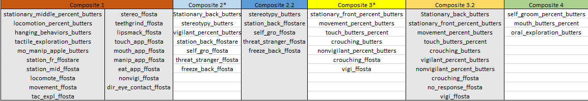

```{r setup, include=FALSE, message=FALSE, warning=FALSE}
knitr::opts_chunk$set(echo = TRUE)
```
#this is the document for making SEM models - AM_5/6

```{r, warning=FALSE, message=FALSE, echo=FALSE}
library(tidyselect)
library(ggplot2)
library(broom)
library(dplyr)
library(corrplot)
library(kableExtra)
library(knitr)
library(Hmisc)
library(infer)
library(plotly) 
library(skimr)
library(stringr)
library(reshape2)
library(som)
library(manipulate)
library(lavaan)
library(semPlot)
library(FactoMineR)
library(factoextra)
library(readxl)
library(formattable)
library(DT)
library(xtable)
library(wesanderson)
```

The purpose of this document is to outline of the methods used to contruct composite variables from the raw behaviors collected form the Human Intruder Task. The data include the **Stare, Familiar Food Offer, and Novel Object** epochs and a total of 37 behaviors were included in the analysis. 

Briefly, raw behaviors were normalized and subjected to a correlational analysis. The output of this analysis is visualized below and the values are outlined in the table. If you want to view specific relationships about certain behaviors, type the behavior (starting with 'Z' - so ' Zstationary..'). You can also filter by value by typing in the starting range of the desired correlational values. All correlations with a value of 1 were removed from the table.   

##Correlations: Values and Visuals##

```{r loading the data, echo=FALSE, warning=FALSE, message=FALSE}
znormed_ffostare_v1 <- read_excel("znormed_ffostare_v1.xlsx")
#skim(znormed_ffostare_v1)

#the znormed_ffostare_v1 is corrected output of ffo_corrected_spssout_full. then, for demographic information use selected_norms_composites_demgrafs_v1_use
selected_norms_ffostare_v1 <- znormed_ffostare_v1 %>%
  select(-Observations, - ResultContainers, - Intervals, - Zno_sec_behav_ffosta)
         
#glimpse(selected_norms_ffostare_v1)         
```

Below is the correlation output for the data. 

```{r, echo=FALSE}
corrnorm_selected_ffostare_v1 <- cor(selected_norms_ffostare_v1)   
melted_corrnorm_selected_ffostare_v1 <- melt(corrnorm_selected_ffostare_v1)


ggplot(melted_corrnorm_selected_ffostare_v1, aes(x=Var2, y=Var1, fill=value)) +
  ggtitle("Combined Behavioral Correlations") +
  geom_tile() +
  scale_fill_gradient(low = "dark blue", high = "yellow") + 
  theme_minimal() +
  theme(axis.text.x = element_text(angle = 45,
                                   vjust = 1,
                                   size = 9,
                                   hjust = 1))


melted_corrnorm_selected_ffostare_v1_reduced <- melted_corrnorm_selected_ffostare_v1[order(melted_corrnorm_selected_ffostare_v1$value, decreasing = TRUE),] %>%
  filter(value <= .99)

#kable(melted_corrnorm_selected_ffostare_v1_reduced) %>%
  #kable_styling(bootstrap_options = c("hover", "condensed", "striped")) %>% 
  #scroll_box(width = "1000px", height = "400px")

as.datatable(formattable(melted_corrnorm_selected_ffostare_v1_reduced,
                         align = c("l", "l")))


#####new 5/6/19####
#######introducing the pca to see how many factors to expect#########
#####new 5/6/19####

total_PCA_v1_5_6 <- prcomp(selected_norms_ffostare_v1)

fviz_screeplot(total_PCA_v1_5_6, addlabels = TRUE)

summary(total_PCA_v1_5_6)

fviz_pca_ind(total_PCA_v1_5_6,
            col.ind = "cos2",
            repel = TRUE)

fviz_pca_ind(total_PCA_v1_5_6,
         geom.ind = "point",
         col.ind = as.factor("cos2"), 
         gradient = "Dark2",
         repel = F,
         addEllipses = TRUE
         )

total_PCA_var <- get_pca_var(total_PCA_v1_5_6)


##the information below will tell you which variables contribute the most to each component
barplot(total_PCA_var$contrib [,1])

```


The correlational values above were used to investigate the relationships amongst the behaviors. Specifically, how behaviors cluster together. To do this, an empirical approach was chosen that used community detection algorithm to determine which behaviors were clustering together. 

The headers (l25_h6, l3_h6, etc..) respresent the parameter changes that were made for each output. So, l25_h6 means that the low edge density was set to .25 whereas the high edge density is set to .6. The high edge density is not set higher than .8 since the strongest connection about the correlation matrix is .75. As for the lower density, we do have correlation values below .25 but setting my edge density to .2 has crashed the detection algorithm the past. 


 

##Inidividual Composite Scores##

The output of the community detection is outline below. 4 communities were detected by this empirical process. These communities will now be referred to as **composite behaviors** (thus 4 composite behaviors emerged from this analysis) which I will investigate diet and sex differences. 

One thing I want to do is reduce the size of **Composite 1**, as it contains too many variables to accurately define a latent behavioral trait. PCA and SEM modeling was used to investigated the strength of these composite groupings; those figures are at the end of this document.   


```{r creating the composite scores, echo=FALSE}
selected_norms_ffostare_v1$comp_1 <- selected_norms_ffostare_v1$Zstationary_middle_percent_butters + selected_norms_ffostare_v1$Zlocomotion_percent_butters + selected_norms_ffostare_v1$Zhanging_behaviors_butters + selected_norms_ffostare_v1$Ztactile_exploration_butters + selected_norms_ffostare_v1$Zmo_manip_apple_butters + selected_norms_ffostare_v1$Zstation_fr_ffostare + selected_norms_ffostare_v1$Zstation_mid_ffosta + selected_norms_ffostare_v1$Zlocomote_ffosta + selected_norms_ffostare_v1$Zmovement_ffosta + selected_norms_ffostare_v1$Ztac_expl_ffosta + selected_norms_ffostare_v1$Zstereo_ffosta + selected_norms_ffostare_v1$Zteethgrind_ffosta + selected_norms_ffostare_v1$Zlipsmack_ffosta + selected_norms_ffostare_v1$Ztouch_app_ffosta + selected_norms_ffostare_v1$Zmouth_app_ffosta + selected_norms_ffostare_v1$Zmanip_app_ffosta + selected_norms_ffostare_v1$Zeat_app_ffosta + selected_norms_ffostare_v1$Znonvigi_ffosta + selected_norms_ffostare_v1$Zdir_eye_contact_ffosta
  
selected_norms_ffostare_v1$comp_2 <- selected_norms_ffostare_v1$ZStationary_back_butters + selected_norms_ffostare_v1$Zstereotypy_butters + selected_norms_ffostare_v1$Zvigilant_percent_butters + selected_norms_ffostare_v1$Zstation_back_ffostare + selected_norms_ffostare_v1$Zself_gro_ffosta + selected_norms_ffostare_v1$Zthreat_stranger_ffosta + selected_norms_ffostare_v1$Zfreeze_back_ffosta 
  
selected_norms_ffostare_v1$comp_3 <- selected_norms_ffostare_v1$Zstationary_front_percent_butters + selected_norms_ffostare_v1$Zmovement_percent_butters + selected_norms_ffostare_v1$Ztouch_butters_percent + selected_norms_ffostare_v1$Zcrouching_butters + selected_norms_ffostare_v1$Znonvigilant_percent_butters + selected_norms_ffostare_v1$Zcrouching_ffosta + selected_norms_ffostare_v1$Zvigi_ffosta + selected_norms_ffostare_v1$Zno_response_ffosta
  
selected_norms_ffostare_v1$comp_4 <- selected_norms_ffostare_v1$Zself_groom_percent_butters + selected_norms_ffostare_v1$Zmouth_butters_percent + selected_norms_ffostare_v1$Zoral_exploration_butters 
```


```{r no response groups, echo=FALSE, warning=FALSE, message=FALSE}
#took two variables from composite 2 and add them to composite 3. 
selected_norms_ffostare_v1$comp_2.2 <- selected_norms_ffostare_v1$Zstereotypy_butters + selected_norms_ffostare_v1$Zstation_back_ffostare + selected_norms_ffostare_v1$Zself_gro_ffosta + selected_norms_ffostare_v1$Zthreat_stranger_ffosta + selected_norms_ffostare_v1$Zfreeze_back_ffosta


selected_norms_ffostare_v1$comp_3.2 <- selected_norms_ffostare_v1$Zstationary_front_percent_butters + selected_norms_ffostare_v1$Zmovement_percent_butters + selected_norms_ffostare_v1$Ztouch_butters_percent + selected_norms_ffostare_v1$Zcrouching_butters + selected_norms_ffostare_v1$Znonvigilant_percent_butters + selected_norms_ffostare_v1$Zcrouching_ffosta + selected_norms_ffostare_v1$Zvigi_ffosta + selected_norms_ffostare_v1$Zno_response_ffosta + selected_norms_ffostare_v1$ZStationary_back_butters + selected_norms_ffostare_v1$Zvigilant_percent_butters

#skim(selected_norms_ffostare_v1)

#write.csv(selected_norms_ffostare_v1, "selected_norms_composites_demgraf_v2.csv")
```

The output below represents the composite scores for the individual animals. 

Composite scores were created by taking the value of each individual behavior from the output of community detection. Below represent the individual scores for each animal and their respective categorical groupings.

You will notice a **2.2 and 3.2 group**. In short, I will likely want to move forward with that composite group given the effect it had. The group came about after a meeting with Elinor where she suggested I reincorporate the 'no_response' behavior. Simply, creating a new composite group to represent this was easier than redoing and renaming all the previous files I made. I'm confident I can explain this in person. 


```{r inserting demographic infomation, echo=FALSE}
selected_norms_composites_demgraf_v1.2 <- read.csv("selected_norms_composites_demgraf_v2.csv")
#View(selected_norms_composites_demgraf_v1.2)

composite_scores_withgroups <- selected_norms_composites_demgraf_v1.2[order(selected_norms_composites_demgraf_v1.2$initial_diet),]  %>%
  select(Observations, sex, initial_diet, new_diet, comp_1, comp_2, comp_3, comp_4, comp_3.2, comp_2.2) 

composite_scores_withgroups$initial_diet <- as.factor(composite_scores_withgroups$initial_diet)
composite_scores_withgroups$new_diet <- as.factor(composite_scores_withgroups$new_diet)
composite_scores_withgroups$sex <- as.factor(composite_scores_withgroups$sex)

#str(composite_scores_withgroups)
as.datatable(formattable(composite_scores_withgroups,
                         align = c("l", "l", "l", "l", "l","l", "l", "l", "l", "l" )
                         ))

#View(composite_scores_withgroups)

#(composite_scores_withgroups)

#kable(composite_scores_withgroups) %>%
 # kable_styling(bootstrap_options = c("hover", "condensed", "striped"),
                #full_width = F,
                #position = "center") %>%
  #add_header_above(c(" " = 2, "Diet Groups" = 2, "Composite Scores" = 6))

```

```{r filtering out individuals with postnatal diet group 2, echo=FALSE}
matdiet_filtered <- composite_scores_withgroups %>%
  filter(!new_diet == 2)

matdiet_filtered_v2 <- composite_scores_withgroups %>%
  filter(!new_diet == 2)

#View(matdiet_filtered_v2)

#write.csv(matdiet_filtered_v2, "filtered4matdiet_compositesonly.csv")
```


##Wilcoxon Tests on effects of Maternal Diet, Sex, and Postnatal Diet##

Below are the p-values for each of the composite groups. These values were calculated using the Wilcoxon rank sum test after failing the normality test. Only Composite Variable 1, Composite Variable 2 and Composite Variable 2.2 displayed a significant effect of diet group. Significant p-values are in **bold**. 

These data are void of subjects with a postnatal HFD diet in order to only look at the effects of maternal diet on temperament. 

```{r t test for effects of maternal diet, echo=FALSE, warning = FALSE, mesage = FALSE}
matdiet_filtered_wiltest_comp1 <- wilcox.test(matdiet_filtered$comp_1~matdiet_filtered$initial_diet)
matdiet_filtered_wiltest_comp2 <- wilcox.test(matdiet_filtered$comp_2~matdiet_filtered$initial_diet)
matdiet_filtered_wiltest_comp3 <- wilcox.test(matdiet_filtered$comp_3~matdiet_filtered$initial_diet)
matdiet_filtered_wiltest_comp4 <- wilcox.test(matdiet_filtered$comp_4~matdiet_filtered$initial_diet)
matdiet_filtered_wiltest_comp3.2 <- wilcox.test(matdiet_filtered_v2$comp_3.2~matdiet_filtered$initial_diet)
matdiet_filtered_wiltest_comp2.2 <- wilcox.test(matdiet_filtered_v2$comp_2.2~matdiet_filtered$initial_diet)
matdiet_filtered_wiltest_comp1_check <- wilcox.test(matdiet_filtered_v2$comp_1~matdiet_filtered$initial_diet)


matdiet_pvals <- c(matdiet_filtered_wiltest_comp1$p.value, matdiet_filtered_wiltest_comp2$p.value, matdiet_filtered_wiltest_comp2.2$p.value, matdiet_filtered_wiltest_comp3$p.value, matdiet_filtered_wiltest_comp3.2$p.value, matdiet_filtered_wiltest_comp4$p.value)
composite_frame_matdietpval <- c("Composite 1 P-value",
                                 "Composite 2 P-value",
                                 "Composite 2.2 P-value",
                                 "Composite 3 P-value",
                                 "Composite 3.2 P-value",
                                 "Composite 4 P-value")

matdiet_composite_difference <- data.frame(composite_frame_matdietpval, matdiet_pvals)

#View(matdiet_composite_difference)

#kable(matdiet_composite_difference, format = "html", align=rep('l', 5)) %>%
  #kable_styling(bootstrap_options = c("condensed", "striped"))


bold_pvals <- formatter("span",
                        style = x ~ style("font-weight" = ifelse(x<.05, "bold", NA)))

#formattable(matdiet_composite_difference, list(
  #matdiet_pvals = bold_pvals
#))

as.datatable(formattable(matdiet_composite_difference,
                         align = c("l", "l"),
                         list(matdiet_pvals = bold_pvals)
                         ))

#xtab1 <- xtable(summary(matdiet_filtered_wiltest_comp2))
#View(xtab1)

#make a data table here!
```

```{r}
#melted_scores <- melt(matdiet_filtered_v2, id.vars = "initial_diet") %>%
  #filter(!variable %in% "Observations", "sex", "new_diet") 

#str(matdiet_filtered_v2)

#melted_scores_avg <- group_by(melted_scores, initial_diet) %>%
  #summarise(mean(variable$comp_1, variable$comp_2.2, variable$comp_3.2, variable$comp_4))

matdiet_filtered_v2_avgcomp1_d1 <- matdiet_filtered_v2 %>%
  filter(initial_diet == 1) %>%
  select(comp_1)
matdiet_filtered_v2_avgcomp2.2_d1 <- matdiet_filtered_v2 %>%
  filter(initial_diet == 1) %>%
  select(comp_2.2)
matdiet_filtered_v2_avgcomp3.2_d1 <- matdiet_filtered_v2 %>%
  filter(initial_diet == 1) %>%
  select(comp_3.2)
matdiet_filtered_v2_avgcomp4_d1 <- matdiet_filtered_v2 %>%
  filter(initial_diet == 1) %>%
  select(comp_4)


View(matdiet_filtered_v2_avgcomp1_d1)

value_matdiet_filtered_v2_avgcomp1_d1 <- mean(matdiet_filtered_v2_avgcomp1_d1$comp_1)
value_matdiet_filtered_v2_avgcomp2.2_d1 <- mean(matdiet_filtered_v2_avgcomp2.2_d1$comp_2.2)
value_matdiet_filtered_v2_avgcomp3.2_d1 <- mean(matdiet_filtered_v2_avgcomp3.2_d1$comp_3.2)
value_matdiet_filtered_v2_avgcomp4_d1 <- mean(matdiet_filtered_v2_avgcomp4_d1$comp_4)
d1_avg_matdiet_values <- c(value_matdiet_filtered_v2_avgcomp1_d1, value_matdiet_filtered_v2_avgcomp2.2_d1, value_matdiet_filtered_v2_avgcomp3.2_d1, value_matdiet_filtered_v2_avgcomp4_d1)

View(d1_avg_matdiet_values)


matdiet_filtered_v2_avgcomp1_d2 <- matdiet_filtered_v2 %>%
  filter(initial_diet == 2) %>%
  select(comp_1)
matdiet_filtered_v2_avgcomp2.2_d2 <- matdiet_filtered_v2 %>%
  filter(initial_diet == 2) %>%
  select(comp_2.2)
matdiet_filtered_v2_avgcomp3.2_d2 <- matdiet_filtered_v2 %>%
  filter(initial_diet == 2) %>%
  select(comp_3.2)
matdiet_filtered_v2_avgcomp4_d2 <- matdiet_filtered_v2 %>%
  filter(initial_diet == 2) %>%
  select(comp_4)

value_matdiet_filtered_v2_avgcomp1_d2 <- mean(matdiet_filtered_v2_avgcomp1_d2$comp_1)
value_matdiet_filtered_v2_avgcomp2.2_d2 <- mean(matdiet_filtered_v2_avgcomp2.2_d2$comp_2.2)
value_matdiet_filtered_v2_avgcomp3.2_d2 <- mean(matdiet_filtered_v2_avgcomp3.2_d2$comp_3.2)
value_matdiet_filtered_v2_avgcomp4_d2 <- mean(matdiet_filtered_v2_avgcomp4_d2$comp_4)

value_matdiet_filtered_v2_avgcomp1_d2_err <- std.error(matdiet_filtered_v2_avgcomp1_d2$comp_1)
value_matdiet_filtered_v2_avgcomp2.2_d2_err <- stderr(matdiet_filtered_v2_avgcomp2.2_d2$comp_2.2)
value_matdiet_filtered_v2_avgcomp3.2_d2_err <- stderr(matdiet_filtered_v2_avgcomp3.2_d2$comp_3.2)
value_matdiet_filtered_v2_avgcomp4_d2_err <- stderr(matdiet_filtered_v2_avgcomp4_d2$comp_4)


####calculate standard error for other metrics###
###get elinor the data
library(Hmisc)
library(psych)

des_comp_1 <- describe(matdiet_filtered_v2_avgcomp1_d2$comp_1)

se_des_comp1   <- des_comp_1$se

#d1_avg_matdiet_values <- c(value_matdiet_filtered_v2_avgcomp1_d2, value_matdiet_filtered_v2_avgcomp2.2_d2, value_matdiet_filtered_v2_avgcomp3.2_d2, value_matdiet_filtered_v2_avgcomp4_d2)
d2_avg_matdiet_values <- c(value_matdiet_filtered_v2_avgcomp1_d2, value_matdiet_filtered_v2_avgcomp2.2_d2, value_matdiet_filtered_v2_avgcomp3.2_d2, value_matdiet_filtered_v2_avgcomp4_d2)

title_avg_matdiet_values <- c("Composite 1", 
                              "Composite 2.2", 
                              "Composite 3.2",
                              "Composite 4")

View(d2_avg_matdiet_values)

table_avg_matdiet_values <- data.frame(title_avg_matdiet_values, d1_avg_matdiet_values, d2_avg_matdiet_values)

View(table_avg_matdiet_values)
#needed to further clarify these differences and we see that not only is composite group 2.2 the group showing diet differences, but animals exposed to the HFD score highest on this composite variable than the others. 
#i did this because i was concerned that people would say this is not a representation of temperament.
 ggplot(table_avg_matdiet_values, aes(x=title_avg_matdiet_values, y=d1_avg_matdiet_values)) +
  geom_bar(stat="identity")
 ggplot(table_avg_matdiet_values, aes(x=title_avg_matdiet_values, y=d2_avg_matdiet_values)) +
  geom_bar(stat="identity")

diet_avg <- c(value_matdiet_filtered_v2_avgcomp1_d1, value_matdiet_filtered_v2_avgcomp2.2_d1, value_matdiet_filtered_v2_avgcomp3.2_d1, value_matdiet_filtered_v2_avgcomp4_d1, value_matdiet_filtered_v2_avgcomp1_d2, value_matdiet_filtered_v2_avgcomp2.2_d2, value_matdiet_filtered_v2_avgcomp3.2_d2, value_matdiet_filtered_v2_avgcomp4_d2)
diet_vec <- c(1,1,1,1,2,2,2,2)
diet_vec_title <- c("Composite 1", 
                    "Composite 2.2", 
                    "Composite 3.2",
                    "Composite 4",
                    "Composite 1", 
                    "Composite 2.2", 
                    "Composite 3.2",
                    "Composite 4")
all_diet_table <- data.frame(diet_vec_title, diet_vec, diet_avg)

all_diet_table$diet_vec <- as.factor(all_diet_table$diet_vec)

View(all_diet_table)

gplot_diet_avgs <- ggplot(all_diet_table, aes(x=diet_vec_title, y=diet_avg, fill=diet_vec)) +
  geom_bar(stat="identity", position = "dodge")

gplot_diet_avgs +labs(title = "Diet Group Averages", x="Composite Groups", y="Composite Scores") +
  theme_minimal() +
  #scale_fill_brewer(palette = "Accent")
  scale_fill_manual(values = wes_palette(n=4, "Cavalcanti1"))

###can delete most of this below
#matdiet_filtered_v2_avgcomp2.2 <- mean(matdiet_filtered_v2$comp_2.2)
#matdiet_filtered_v2_avgcomp3.2 <- mean(matdiet_filtered_v2$comp_3.2)
#matdiet_filtered_v2_avgcomp4 <- mean(matdiet_filtered_v2$comp_4)

#filterd_avgs <- c(matdiet_filtered_v2_avgcomp1, matdiet_filtered_v2_avgcomp2.2, matdiet_filtered_v2_avgcomp3.2, matdiet_filtered_v2_avgcomp4)


#str(melted_scores)

#View(matdiet_filtered_v2_avgcomp1)

#ggplot(melted_scores, aes(x=initial_diet, y=value, color = initial_diet)) +
  #geom_jitter()

#ggplot(matdiet_filtered_v2, aes(x=initial_diet, y= comp_2.2)) %>%
  #boxplot()

```

Below are scatterplots and bar plots of individual scores relating to the significant composite behaviors. Bar plots can provide insight into specific cohort differences whereas the scatterplots let you see the visualize the overall difference in performance. Only the results of the maternal diet were visualized. 

These graphs are interactive, and hovering over your interest point may tell you what you need to know. 

```{r visulizations of significant composites for maternal diet, echo=FALSE, warning = FALSE}
ggcomp1 <- ggplot(matdiet_filtered, aes(x=Observations, y=comp_1, color=initial_diet, fill=initial_diet)) +
  geom_bar(stat = "identity", width = 20, position = position_dodge())

ggcomp2 <- ggplot(matdiet_filtered, aes(x=Observations, y=comp_2, color=initial_diet, fill=initial_diet)) +
  geom_bar(stat = "identity", width = 20, position = position_dodge())

ggcomp2.2 <- ggplot(matdiet_filtered_v2, aes(x=Observations, y=comp_2.2, fill=initial_diet)) +
  geom_bar(stat = "identity", width = 20, position = position_dodge())

ggcomp2.2 +labs(title = "Composite 2.2 Score", x="Animal ID", y="Composite Score") +
  scale_color_manual(values = wes_palette(n=4, "FantasticFox1"))

dotplotly_comp2 <- ggplot(matdiet_filtered, aes(x=Observations, y=comp_2, color=initial_diet, fill=initial_diet)) +
  geom_point(stat = "identity") + 
  geom_smooth(method = "lm", se = FALSE)

dotplotly_comp2.2 <- ggplot(matdiet_filtered_v2, aes(x=Observations, y=comp_2.2, color=initial_diet, fill=initial_diet)) +
  geom_point(stat = "identity") + 
  geom_smooth(method = "lm", se = FALSE)

ggcompl2_ly <- ggplotly(ggcomp2)
ggcompl2_ly

ggdotcomp2_ly <- ggplotly(dotplotly_comp2)
ggdotcomp2_ly

ggcompl2.2_ly <- ggplotly(ggcomp2.2)
ggcompl2.2_ly

ggdotcomp2.2_ly <- ggplotly(dotplotly_comp2.2)
ggdotcomp2.2_ly


dotplotly_comp1 <- ggplot(matdiet_filtered, aes(x=Observations, y=comp_1, color=initial_diet, fill=initial_diet)) +
  geom_point(stat = "identity") + 
  geom_smooth(method = "lm", se = FALSE)

ggcompl1_ly <- ggplotly(ggcomp1)

ggcompl1_ly

ggdotcomp1_ly <- ggplotly(dotplotly_comp1)

ggdotcomp1_ly
```

The table below describes differences observed based on sex. Apologies on not changing the variable names.. it was a time consuming process.  

```{r, echo=FALSE, warning=FALSE, message=FALSE}
matdiet_sex_wiltest_comp1 <- wilcox.test(matdiet_filtered$comp_1~matdiet_filtered$sex)
matdiet_sex_wiltest_comp2 <- wilcox.test(matdiet_filtered$comp_2~matdiet_filtered$sex)
matdiet_sex_wiltest_comp3 <- wilcox.test(matdiet_filtered$comp_3~matdiet_filtered$sex)
matdiet_sex_wiltest_comp4 <- wilcox.test(matdiet_filtered$comp_4~matdiet_filtered$sex)
matdiet_sex_wiltest_comp3.2 <- wilcox.test(matdiet_filtered_v2$comp_3.2~matdiet_filtered$sex)
matdiet_sex_wiltest_comp2.2 <- wilcox.test(matdiet_filtered_v2$comp_2.2~matdiet_filtered$sex)

#matdiet_sex_wiltest_comp3.2$p.value

matdiet_sex_pvals <- c(matdiet_sex_wiltest_comp1$p.value, matdiet_sex_wiltest_comp2$p.value, matdiet_sex_wiltest_comp2.2$p.value, matdiet_sex_wiltest_comp3$p.value, matdiet_sex_wiltest_comp3.2$p.value, matdiet_sex_wiltest_comp4$p.value)
composite_sexframe_matdietpval <- c("Composite 1 P-value ",
                                 "Composite 2 P-value",
                                 "Composite 2.2 P-value",
                                 "Composite 3 P-value",
                                 "Composite 3.2 P-value",
                                 "Composite 4 P-value")

matdiet_composite_difference_sex <- data.frame(composite_sexframe_matdietpval, matdiet_sex_pvals)

as.datatable(formattable(matdiet_composite_difference_sex,
                         align = c("l", "l")
                         ))
```

The table below describes the effect of postnatal diet only. Only subjects with prenatal HFD and postnatal HFD exposure were compared to pre/postnatal controls. 

```{r filtering out individuals with materal diet group 1, echo=FALSE, warning=FALSE, message=FALSE}
#for shits and giggles, here i'm filitering down to subjects that had both matdiet2 and post2 vs matdiet1 and matdiet1

#glimpse(composite_scores_withgroups)


newdiet_filtered <- composite_scores_withgroups %>%
  filter(Observations %in% c(30586, 30637, 30639, 30726, 31266, 30155, 30181, 30397, 30398, 31177, 31347, 31347, 31479, 31480, 31700))

newdiet_differences_wiltest_comp1 <- wilcox.test(newdiet_filtered$comp_1~newdiet_filtered$new_diet)
newdiet_differences_wiltest_comp2 <- wilcox.test(newdiet_filtered$comp_2~newdiet_filtered$new_diet)
newdiet_differences_wiltest_comp2.2 <- wilcox.test(newdiet_filtered$comp_2.2~newdiet_filtered$new_diet)
newdiet_differences_wiltest_comp3 <- wilcox.test(newdiet_filtered$comp_3~newdiet_filtered$new_diet)
newdiet_differences_wiltest_comp3.2 <- wilcox.test(newdiet_filtered$comp_3.2~newdiet_filtered$new_diet)
newdiet_differences_wiltest_comp4 <- wilcox.test(newdiet_filtered$comp_4~newdiet_filtered$new_diet)

#newdiet_differences_wiltest_comp4$p.value

newdiet_pvals <- c(newdiet_differences_wiltest_comp1$p.value, newdiet_differences_wiltest_comp2$p.value, newdiet_differences_wiltest_comp2.2$p.value, newdiet_differences_wiltest_comp3$p.value, newdiet_differences_wiltest_comp3.2$p.value, newdiet_differences_wiltest_comp4$p.value)
newdiet_titles <- c("Composite 1 P-value ",
                    "Composite 2 P-value",
                    "Composite 2.2 P-value",
                    "Composite 3 P-value",
                    "Composite 3.2 P-value",
                    "Composite 4 P-value")
newdiet_pvals_df <- data.frame(newdiet_titles, newdiet_pvals)
as.datatable(formattable(newdiet_pvals_df, 
                         align = c("l", "l")
                         ))
#View(newdiet_pvals_df)
```

##PCAs and Structural Models##

Below are the results from the PC Analysis looking at the composite behavior groups. Additionally, structural equation modeling has been used to look at the strength of the groupings. Only models representing composites that showed significant effects of diet on behavior were visualized. Unfortunately, there was not a more aesthetic way to present this data. 

```{r creating individual composites for pca and sem, echo=FALSE, warning=FALSE, message=TRUE}
comp1_indi <- selected_norms_ffostare_v1 %>%
  select(Zstationary_middle_percent_butters, Zlocomotion_percent_butters, Zhanging_behaviors_butters, Ztactile_exploration_butters, Zmo_manip_apple_butters, Zstation_fr_ffostare,  Zstation_mid_ffosta, Zlocomote_ffosta, Zmovement_ffosta, Ztac_expl_ffosta,  Zstereo_ffosta, Zteethgrind_ffosta, Zlipsmack_ffosta, Ztouch_app_ffosta, Zmouth_app_ffosta, Zmanip_app_ffosta, Zeat_app_ffosta, Znonvigi_ffosta, Zdir_eye_contact_ffosta)

comp2_indi <- selected_norms_ffostare_v1 %>%
  select(ZStationary_back_butters, Zstereotypy_butters, Zvigilant_percent_butters, Zstation_back_ffostare, Zself_gro_ffosta, Zthreat_stranger_ffosta, Zfreeze_back_ffosta)

comp2.2_indi <- selected_norms_ffostare_v1 %>%
  select(Zstereotypy_butters, Zstation_back_ffostare, Zself_gro_ffosta, Zthreat_stranger_ffosta, Zfreeze_back_ffosta)

comp3_indi <- selected_norms_ffostare_v1 %>%
  select(Zstationary_front_percent_butters, Zmovement_percent_butters, Ztouch_butters_percent, Zcrouching_butters, Znonvigilant_percent_butters, Zcrouching_ffosta, Zvigi_ffosta, Zno_response_ffosta)

comp3.2_indi <- selected_norms_ffostare_v1 %>%
  select(ZStationary_back_butters, Zstationary_front_percent_butters, Zmovement_percent_butters, Zvigilant_percent_butters, Ztouch_butters_percent, Zcrouching_butters, Znonvigilant_percent_butters, Zcrouching_ffosta, Zvigi_ffosta, Zno_response_ffosta)

comp4_indi <- selected_norms_ffostare_v1 %>%
  select(Zself_groom_percent_butters, Zmouth_butters_percent, Zoral_exploration_butters)

```

**The text box will describe the scree plot visualization below. The scree plot represents how much each component is contributing to the variance about composite behavior group.**

```{r, echo=FALSE, warning = FALSE, message = FALSE}
princi_comp1 <- prcomp(comp1_indi)
summary(princi_comp1)
#princi_comp1$sdev
princ1_ploty  <- ggplotly(fviz_eig(princi_comp1, main = "variance explained: components of comp_1"))

#xtable(princi_comp1)

princ1_ploty

princi_comp2 <- prcomp(comp2_indi)
summary(princi_comp2)
#fviz_eig(princi_comp2, main = 'variance explained: components of comp_2')

#princi_comp2

princ2_ploty <- ggplotly(fviz_eig(princi_comp2, main = 'variance explained: components of comp_2'))

princ2_ploty

princi_comp2.2 <- prcomp(comp2.2_indi)
summary(princi_comp2.2)
#fviz_eig(princi_comp2.2, main = 'variance explained: components of comp_2.2')

#xtable

princ2.2_ploty <- ggplotly(fviz_eig(princi_comp2.2, main = 'variance explained: components of comp_2.2'))

princ2.2_ploty

princi_comp3 <- prcomp(comp3_indi)
summary(princi_comp3)
#fviz_eig(princi_comp3, main = "variance explained: components of comp_3")

#xtable

princ3_ploty <- ggplotly(fviz_eig(princi_comp3, main = 'variance explained: components of comp_3'))

princ3_ploty

princi_comp3.2 <- prcomp(comp3.2_indi)
summary(princi_comp3.2)
#fviz_eig(princi_comp3.2, main = 'variance explained: components of comp_3.2')

#xtable

princ3.2_ploty <- ggplotly(fviz_eig(princi_comp3.2, main = 'variance explained: components of comp_3.2'))

princ3.2_ploty

princi_comp4 <- prcomp(comp4_indi)
summary(princi_comp4)
#fviz_eig(princi_comp4, main = "variance explained: components of comp_4")

#xtable

princ4_ploty <- ggplotly(fviz_eig(princi_comp4, main = 'variance explained: components of comp_4'))

princ4_ploty
```

**Structural Models** Again, the text box above will describe the visualization below. I am interested in the RMSEA, CFI, and TLI values. It is a bit hard to find but the output is very similar to Mplus. These models used the **MLR** estimator to mimic the model used in Mplus. 

Additionally, one reason why I want to keep the 2.2 grouping is because it removes the negative loading variables in the model; making it stronger. 


```{r, echo=FALSE, message=FALSE, warning=FALSE}
#need to add visualizations here
selected_behaviors_latemods <- selected_norms_composites_demgraf_v1.2 %>%
  select(- comp_1, - comp_2, - comp_3, - comp_4, -comp_2.2, -comp_3.2)

SEM_comp1 <- 'latemod_comp1 =~ Zstationary_middle_percent_butters + Zlocomotion_percent_butters + Zhanging_behaviors_butters + Ztactile_exploration_butters + Zmo_manip_apple_butters + Zstation_fr_ffostare + Zstation_mid_ffosta + Zlocomote_ffosta + Zmovement_ffosta + Ztac_expl_ffosta + Zstereo_ffosta + Zteethgrind_ffosta + Zlipsmack_ffosta + Ztouch_app_ffosta + Zmouth_app_ffosta + Zmanip_app_ffosta + Zeat_app_ffosta + Znonvigi_ffosta + Zdir_eye_contact_ffosta'

SEM_comp1_fit <- cfa(model = SEM_comp1, estimator = "MLR", data = selected_behaviors_latemods)
summary(SEM_comp1_fit, standardize = TRUE, fit.measures = TRUE)  

SEM_comp1_fit

semPaths(SEM_comp1_fit,
         layout = "tree",
         color = "gray",
         whatLabels = "std",
         edge.color = "black",
         what = "std", 
         rotation = 2,
         edge.label.cex = 1.25, 
         nCharNodes = 8, 
         sizeLat = 10, 
         sizeMan = 10, 
         title = TRUE)


SEM_comp2 <- 'latemod_comp2 =~ ZStationary_back_butters + Zstereotypy_butters + Zvigilant_percent_butters + Zstation_back_ffostare + Zself_gro_ffosta + Zthreat_stranger_ffosta + Zfreeze_back_ffosta'

SEM_comp2_fit <- cfa(model = SEM_comp2, estimator = "MLR", data = selected_behaviors_latemods)
summary(SEM_comp2_fit, standardize = TRUE, fit.measures = TRUE)
SEM_comp2_table <- parTable(SEM_comp2_fit)

SEM_comp2_fit

semPaths(SEM_comp2_fit,
         layout = "tree",
         color = "gray",
         whatLabels = "std",
         edge.color = "black",
         what = "std", 
         rotation = 2,
         edge.label.cex = 1.25, 
         nCharNodes = 8, 
         sizeLat = 10, 
         sizeMan = 10, 
         title = TRUE)

#as.datatable(formattable(SEM_comp2_fit,
                         #align = c("l", "l", "l", "l", "l", "l", "l", "l", "l", "l", "l", "l", "l", "l", "l")
                         #))

SEM_comp2.2.1 <- 'latemod_comp2.2 =~ Zstereotypy_butters + Zstation_back_ffostare + Zself_gro_ffosta + Zthreat_stranger_ffosta + Zfreeze_back_ffosta'

SEM_comp2.2.1_fit <- cfa(model = SEM_comp2.2.1, estimator = "MLR", data = selected_behaviors_latemods)
summary(SEM_comp2.2.1_fit, standardize = TRUE, fit.measures = TRUE)
SEM_comp2.2_table <- parTable(SEM_comp2.2.1_fit)

SEM_comp2.2.1_fit
#note that we get rid of the negative loadings with this model

semPaths(SEM_comp2.2.1_fit,
         layout = "tree",
         color = "gray",
         whatLabels = "std",
         edge.color = "black",
         what = "std", 
         rotation = 2,
         edge.label.cex = 1.25, 
         nCharNodes = 8, 
         sizeLat = 10, 
         sizeMan = 10, 
         title = TRUE)
  
SEM_comp3 <- 'latemod_comp3 =~ Zstationary_front_percent_butters + Zmovement_percent_butters + Ztouch_butters_percent + Zcrouching_butters + Znonvigilant_percent_butters + Zcrouching_ffosta + Zvigi_ffosta + Zno_response_ffosta'

SEM_comp3_fit <- cfa(model = SEM_comp3, estimator = "MLR", data = selected_behaviors_latemods)
summary(SEM_comp3_fit, standardize = TRUE, fit.measures = TRUE)

SEM_comp3.2 <- 'latemod_comp3.2 =~ Zstationary_front_percent_butters + ZStationary_back_butters + Zmovement_percent_butters + Ztouch_butters_percent + Zvigilant_percent_butters + Zcrouching_butters + Znonvigilant_percent_butters + Zcrouching_ffosta + Zvigi_ffosta + Zno_response_ffosta'

SEM_comp3.2_fit <- cfa(model = SEM_comp3.2, estimator = "MLR", data = selected_behaviors_latemods)
summary(SEM_comp3_fit, standardize = TRUE, fit.measures = TRUE)
  
SEM_comp4 <- 'latemod_comp4 =~ Zself_groom_percent_butters + Zmouth_butters_percent + Zoral_exploration_butters'

SEM_comp4_fit <- cfa(model = SEM_comp4, estimator = "MLR", data = selected_behaviors_latemods)
summary(SEM_comp4_fit, standardize = TRUE, fit.measures = TRUE)
```

##Conclusion##

I would like to use this as a template for the methods sections. I would like to build off some of the figures created, improve them, and use them for publishing paper, abstract, etc. 

Although the Random Forest output was not included, I still feel this document can provide a solid foundation for out meetings over the next few weeks. I also think i need to conceptualize the RF process and output more before i begin talking about it. 

Some things that still need to be discussed are:
 - how to reduce the size of Composite 1
 - is there anything I can do to 'stregthen' the other composite behaviors via empirical approaches
 - what is the direction for moving forward if this looks good.
 

```{r}
#understanding iGraph with correlation data

library(igraph)

corrdataplay1 <- corrnorm_selected_ffostare_v1

corrdataplay1[corrdataplay1>.01 & corrdataplay1<.1]=0

corr_network= graph_from_adjacency_matrix(corrdataplay1, mode = "undirected", weighted = TRUE)

plot(corr_network)

order_corr <- layout_with_fr(corrdataplay1)

plot(order_corr)


cor2graph_v2 <- corrnorm_selected_ffostare_v1 %>%
  filter(abs(r) < .99,
         abs(r) > .3) %>%
  graph_from_data_frame(directed = F)

```